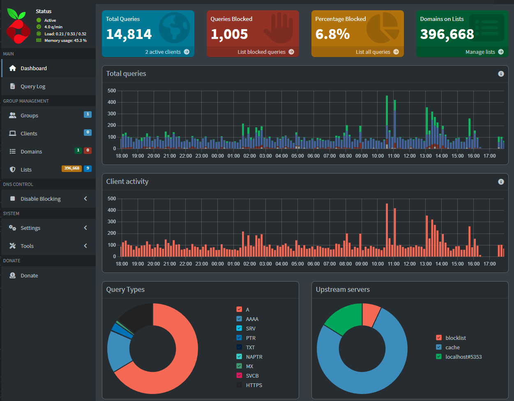

# CasaOS-Project

  Project Description
        Creating a HyperVm that's running Debian 12 no GUI, hosting CasaOS to manage several other projects. Used HyperVm for the purpose of learning another virtual host other then VirtualBox. With HyperVm I learned the difference between the three virtual switches: External, Internal, Private. CasaOS is a open-source community project that allows you to build a personal cloud system in a docker ecosystem; which is super user-friendly. Once installed you can browse "apps" that are included in the "App store". You are able to add more packages from the [Casa github repo](https://awesome.casaos.io/content/3rd-party-app-stores/list.html#_2-casaos-appstore-play). 

#      Other projects 
  
 

 As I started my journey in learning more about this field, I wanted an aternative way to remote into my network that's more secure then just leaving my network open. I found [YouTube](https://youtu.be/sax55mrOX54?si=Sw2JB6fEf78CMCiX) which lead me into this rabbit hole of information. I've started by setting up Windows Firewall rules, changed RDP port within registry editor. Made sure my account has a strong passwords to minimize risk and used network-level authentication when enabling remote access. After a few months in this project I've notice alot of security logs from overseas like Bulgaria, Belgium, England, Luxembourg to name a few places. Trying to login with users like admin/administrator. While my OPSEC was strong, I wanted to reduce the risk futher. I've learned how to block ip address but without a Firewall router it would still be a pain. So I've looked into tailscale and twingate. 

## 🔐 Twingate vs Tailscale

| Feature / Factor        | **Tailscale** 🚀 | **Twingate** 🛡️ |
|-------------------------|------------------|-----------------|
| **Ease of Setup**       | Very easy, plug-and-play | More complex, requires configuration |
| **Security Model**      | Mesh VPN (WireGuard) with ACLs | Zero Trust, micro-segmentation, least privilege |
| **Performance**         | Fast, peer-to-peer (WireGuard) | Relay-based; can be slower if UDP is blocked |
| **Admin Tools**         | Basic logging, ACLs, CLI, SSH support | Detailed audit logs, dashboards, MFA, device posture |
| **Platform Support**    | Windows, macOS, Linux, iOS, Android, Synology, etc. | Wide OS support, strong enterprise identity integrations |
| **Pricing**             | Generous free tier; affordable paid plans | Free tier + paid plans for advanced features |
| **Best For**            | Individuals, small teams, developers | Enterprises, organizations needing strict access controls |

 
 ---- (add another project here, how to enable RDP and have it open to the internet)

Rustdesk and Twingate was my first runner up. Twingate is a zero trust network access, offering an alternative to traditional VPNs. Rustdesk is an open-source remote desktop with self-hosted server, encrypting any connections.

    How To
            

    Credits
        To - Networkchuck
            - CasaOS team
            -rustdesk
